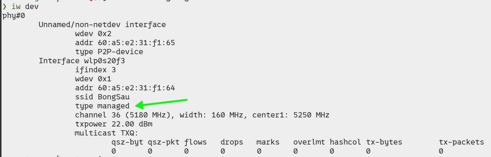

# The security course from Zigexn L&D team

<!--toc:start-->
- [The security course from Zigexn L&D team](#the-security-course-from-zigexn-ld-team)
  - [Other notes](#other-notes)
  - [Structure](#structure)
  - [Hacking lab](#hacking-lab)
  - [On warp terminal](#on-warp-terminal)
  - [Hard disk problems](#hard-disk-problems)
  - [Website hacking - information gathering](#website-hacking-information-gathering)
  - [Website hacking - Files](#website-hacking-files)
  - [Website hacking - SQL injection](#website-hacking-sql-injection)
  - [Website hacking - Cross site scripting (XSS)](#website-hacking-cross-site-scripting-xss)
  - [Website hacking - Discorver vulnerabilities automatically](#website-hacking-discorver-vulnerabilities-automatically)
  - [OWASP top ten](#owasp-top-ten)
  - [Network hacking](#network-hacking)
  - [Network hacking - preconnection attacks](#network-hacking-preconnection-attacks)
  - [Network hacking - WEP cracking](#network-hacking-wep-cracking)
  - [Network hacking - WPA/WPA2 cracking](#network-hacking-wpawpa2-cracking)
  - [Network hacking - security](#network-hacking-security)
<!--toc:end-->

## Other notes

[Note when reading the book](./reading_book.md)

## Structure

This course is divided into 4 sections

1. Network
2. Gaining access
3. Post exploitation
4. Web hacking

## Hacking lab

We setup a lab to practice hacking. The lab contains 3 OSes: windows, kali
linux, and metasploitable. We use VMs.

Windows one will acts as the victim here.

The kali one acts as the hacker. It's a debian-based preinstalled a lot of
tools useful for hackers.

The Metasploitable is a vulnerable linux distro, so this is another victim.

This course suggests using VMware, which is bad. I have disliked this product
for a pretty long time. I don't want to explain why here. I just state that I
will use VirtualBox, at least. At best I would use something like kvm, qemu.

## On warp terminal

I hate the fact that this course suggests using this terminal emulator. The
concept of letting an LLM have access to your shell is really terrible. And
this is a **security** course.

I refuse to use it.

## Hard disk problems

One of my docker volume (database for ONE project) reach nearly 100 GiB. This
Dell laptop that Zigexn provides me does not have enough spaces for me to
confidently install another 3 VMs, especially one of them is a windows. I can
re-fresh my database and reduce the volume to less than 60 GiB, but this
requires the whole next Saturday of mine.

After rebuild my database my machine still does not have enough spaces left to
install these VMs. The Windows 11 requires at least 64GiB. I only have total
50GiB left.

    df -h

    Filesystem      Size  Used Avail Use% Mounted on
    tmpfs           1.6G  2.0M  1.6G   1% /run
    efivarfs        374K  239K  131K  65% /sys/firmware/efi/efivars
    /dev/nvme0n1p2  233G  172G   50G  78% /
    tmpfs           7.7G  1.9M  7.7G   1% /dev/shm
    tmpfs           5.0M  8.0K  5.0M   1% /run/lock
    tmpfs           1.0M     0  1.0M   0% /run/credentials/systemd-journald.service
    tmpfs           1.0M     0  1.0M   0% /run/credentials/systemd-resolved.service
    tmpfs           7.7G   64K  7.7G   1% /tmp
    /dev/nvme0n1p1  1.1G   22M  1.1G   3% /boot/efi
    tmpfs           1.0M     0  1.0M   0% /run/credentials/getty@tty1.service
    tmpfs           1.6G   72K  1.6G   1% /run/user/1000

    docker system df

    TYPE            TOTAL     ACTIVE    SIZE      RECLAIMABLE
    Images          17        14        8.764GB   3.591GB (40%)
    Containers      17        0         368.9MB   368.9MB (100%)
    Local Volumes   15        15        71.02GB   0B (0%)
    Build Cache     222       0         6.605GB   6.605GB

## Website hacking - information gathering

The first step of every hack always is building a profile about the target, I
mean gathering information.

Common for website hacking:

    IP Address
    Domain name info
    Technologies used
    Other websites on the same server
    DNS records
    Unlisted files, sub-domains, directories

The instructor suggests tools for gathering information, such as:

    whois.domaintools.com
    toolbar.netcraft.com
    robtex.com

The problem with these tools is they are online services. They can track our
activities and we are depending on the internet, on someone else's computers
(servers running those services).

I don't really have the expertise on this field but I know there are many tools
that is safer to use. We have some network cli FOSS tools that do not depends
on someone else's server `whois`, `dig`, etc.

I think the only reason we could use these online tools is because we are doing
white hat activities here. But to simulate a real APT, I think we should not.

It is weird that whois tool has the web server information (verion of apache).
I could not reproduce this, even using the same website in the video.

The privacy situation is way better now since all the hosting history
information is gone (from these tools).

`exploit-db.com` is a good resource about exploiting CVEs.

`robtex.com` helps gather information about DNS. We can use the reverse DNS to
gather information about other websites that are hosted on the same server.

We can even use search engine like `bing` to search websites that point to the
same ip address.

Discovering Subdomains: we have the `knockpy` tool (pre-installed on kali
linux). This tool has 2 methods:

- `--recon`: use DNS records.
- `--bruteforce`: use word list and bruteforce checking.

Discovering Sensitive Files: we have the `dirb` tool (also pre-installed on
kali linux). This tool uses bruteforce with wordlist. Which means it's just for
convenient.

## Website hacking - Files

File uploading: we can upload execution files on a server (ex: php shell). We
have tools for generating these scripts. One of them is `weevely`.

`weevely` generated script is really powerful, if success, we can implant
backdoors easily.

Remote code execution: if we managed to run code on a server (ex: through
insecure input), we can plant tcp backdoor using tools like `nc`, python's
`socket`, ruby's `TCPSocket`, or perl, php equivalents, etc.

File inclusion: if a website has the ability to load other files on the system,
we can take advantages of this to load other important files outside of the
current app.

Remote file inclusion: the target website can sometimes load remote files as
well. This behavior makes them terribly vulnerable.

## Website hacking - SQL injection

Most applications are just CRUD apps that interact with databases. So SQL
injection is a pretty serious problem.

To discover SQL injection vulnerabilities, we would manipulate those inputs of
forms, inspect the errors, testing.

We could try to first input valid sql in those inputs and see if it runs
successfully.

After aquired a SQL vulnerability, we can pretty much do almost anything we
want with the target's database.

In SQL we have the function `load_file()`. I did not know this, interesting. We
can even create files `into outfile '/var/www/someapp/dangerous.txt'`

Tool: `sqlmap` - Automatic SQL injection and database takeover tool.

This tool supports many SQL injection techniques and all database management
systems I could think of.

How to prevent SQL injection: parameterized (`select... ?, argument`) ->
separate data from sql code.

## Website hacking - Cross site scripting (XSS)

Reflected XSS: embed javascript into the url param.

Stored XSS: we can store javascript in a website more permanent, in database.
For example we can embed `<script>` tag in a comment, or message in a
guestbook.

We have tool `beef` to help exploit this vulnerability. People run the script
generated by beef then we can control their browser.

Prevent XSS: escape untrusted input before inserting it into the page.

## Website hacking - Discorver vulnerabilities automatically

So hackers also have frameworks. We have `Zap` here, this tool can automate
every thing we've done so far in website hacking and more. This tool provides a
GUI, pretty convenient for pentesters, attackers.

Writing pentest report: This should has its own section, but meh. The report's
first page should contains: title, date, version, pentester(s) information,
target (or the company) and their representatives' information.

Also:

- Executive summary: for low-tech people to understand.
- Engagement summary: scope, risks, findings overview, still for low-tech
  people.
- Legal section: you don't do this yourself.

## OWASP top ten

The Open Worldwide Application Security Project:
A nonprofit foundation, this organization provides The OWASP Top 10, which is a
standard awareness document for developers and web application security.

They update this data every few years, I guess.

They seem legit, since many security courses, instructors, even professors from
HUST mention this site.

## Network hacking

We need a wireless adapter to gain access to a WiFi. The wireless adapter
requires supporting monitor mode; packet injection; ap mode.

We can passthrough a device to the virtual machine through USB, which means
skipping the host. This is a cool concept, I've already learned a bit about
this because I want to passthough my GPU in the past to play video games.

MAC (Media Access Control) Address: This value is assigned to each devices by
the manufacturer. It is: permanent; physical; unique. This value contains
information about the manufacturer, production batch, etc.

The course says MAC addresses are permanent, but as my experience, not really.
My router have spoof MAC feature, even my phone can spoof MAC. So using these
values to identify devices is not really reliable.

As a privacy advocater, I turned on these spoofing features all the time, so
for example a coffee's WiFi network could not track how frequently I go to
their shop.

This course actually shows how to change the MAC address using `ifconfig`. The
goal is to increase anonymity.
Steps are:

1. Disable a network interface `ifconfig <interface> down`.
2. Change hardware address (MAC) `ifconfig <interface> hw ether <MAC address>`.
3. Enable back the interface `ifconfig <interface> up`.

To intercept packages sending to others devices, we would change the
`Mode:Managed` of our device into `Mode:Monitor`.
Steps are:

1. Disable a network interface `ifconfig <interface> down`.
2. Change mode `iwconfig <interface> mode monitor`.
3. Enable back the interface `ifconfig <interface> up`.

Note: On my Ubuntu Plucky, the package or command to manage WiFi interface is
actually called `iw` (newer version, I think). And instead of `mode`, it's
called `type`.



## Network hacking - preconnection attacks

Packet sniffing: we have `airodump-ng` tool that can capture packets, display
detailed info about networks around us, connected clients, etc. This is a part
of `aircrack-ng` suite.

We have 2 standard WiFi bands: 2.4Ghz and 5Ghz.
Low-level names:

    **a** => 5Ghz
    **b, g** => 2.4Ghz
    **ac** => below 6Ghz

Example: scan both 2.4Ghz and 5Ghz:

    ```bash
    airodump-ng --band abg <interface>
    ```

Why not always or default to scan all bands? Because of the efficiency,
scanning more bands mean using more resources to scan, which means slower and
some adapters are not strong enough.


We can discover devices connecting to a network and capture every packages sent
in the network.

We can use `aireplay-ng` to de-auth a device from a network using flag
`--deauth`.

## Network hacking - WEP cracking

**WEP cracking:** This is pretty interesting since I have known about these
WiFi encription algorithms for a pretty long time but never dig into them deep
enough.

WEP encryption uses RC4 algorithm, there is nothing wrong with this algorithm,
the problem is how WEP implement it.

Each package is encrypted using a unique key stream. This key stream is
generated every time for every package. WEP uses a initialization vector (IV)
to do this. This IV plus password, and we have a key stream.

The IV is only 24 bits long and is sent over the air in `plain text`. Yes,
plain text.

On busy network, we can have repeated IVs. These repeated IVs with their
encrypted packages will help attackers determine the key stream. Attackers can
use a statistical attack here. The same data with the same key will create the
same encrypted.

**Step to crack WEP:**

1. Capture a large number of IVs/packages. => `airodump-ng`
    - Even when the network is not busy (the data being transfer is infrequent
      so we would have to wait more to get enough IVs to crack the network), we
      can **force the AP** (access point) to generate IVs.
2. Analyse and crack the key. (This can be done automatically, we have tool for
   this) => `aircrack-ng`

I really want to buy a portable router and tempering with all the networks
around me.

- Fake authentication attack: `aireplay-ng --fakeauth`
- ARP request replay attack: `aireplay-ng --arpreplay`

## Network hacking - WPA/WPA2 cracking

WPA/WPA2 was made to address the issues with WEP.

WPS (Wi‑Fi Protected Setup) is a feature that can be used with WPA/WPA2 and it
is a weakness. It is designed to let clients connect to the network without
entering the password. The goal is the convenient, ease of setup. Yes we all
have to sacrify something for conveniences. Because of the ease of setup in
mind, the authentication is only using 8 digit pins. But if configured
correctly (turn on the PBC - Push button authentication), this would not be an
issue anymore, because user will have to press the WPS button on the router for
it to accepts new device.

1. Brute force to get WPS pin.
2. Use the pin to compute the actual password.

New tool to brute force WPS pin: `reaver`.

We still using the `aireplay-ng --fakeauth` to keep connection with the target.

We need to capture the handshake packages. To do this, we can force a handshake
by disconnect a client from the network and they will be reconnected, and we
got our handshake packages. `aireplay-ng --deauth 4`, 4 means very short amount
of time (4 packages).

This handshake packages, they don't have the information to recover the key.
They do contain the data to verify if a key is valid or not. Which means we can
brute force or use dictionary attack.

To generate wordlists, we can use `crunch`.


Start cracking:

    ```sh
    aircrack-ng <handshake> -w <wordlist>
    ```

We can optimize more by using GPU for example. There are also services to
do the cracking for us. They have powerful machines and good wordlists. We can
search online for them.

## Network hacking - security

**How to prevent these attacks:**

- Don't use WEP
- Use strong password with WPA2
- Disable WPS

We can use `ip route` to identify the gateway to access router settings. Damn,
I was always using the `ip -br a` to see the ip and guess the gateway. Why did
I never search for an efficient way to identify the gateway?

Most of public (coffee store like Highland) WiFis have some soft of
login/authentication pages. I sometimes have a hard time access those pages.
But now I have a way to quickly identify the gateway, I can just type the
gateway into a browser and then get redirect to the login pages. Yay!

The workaround way I have been using is to try access common pages like
`google.com` and I will get redirected to those login pages.
